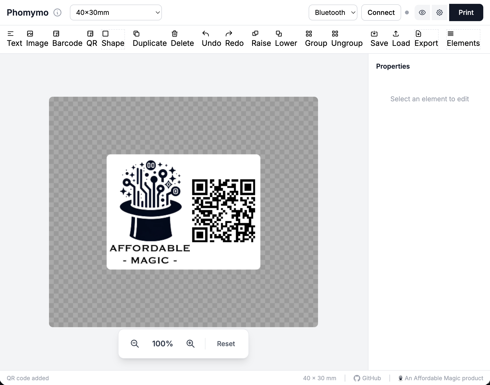

# Phomymo

A free, browser-based label designer for Phomemo thermal printers. No drivers needed - connects via Bluetooth.

**Try it now: https://phomymo.affordablemagic.net**



Supports Phomemo M02-series (M02, M02S, M02X, M02 Pro), M-series (M03, M04S, M110, M120, M200, M220, M221, M250, M260, T02) and D-series (D30, D35, D50, D110, Q30, Q30S) thermal printers.

## Features

### Elements
- **Text** - Multiple fonts, sizes, bold, italic, underline, horizontal and vertical alignment, background colors
- **Images** - Import with scale control and aspect ratio lock
- **Barcodes** - Code128, EAN-13, UPC-A, Code39 formats
- **QR Codes** - Automatic sizing and encoding
- **Shapes** - Rectangle, ellipse, triangle, and line with fill options

### Shape Fills
- Solid black/white fills
- 9 dithered grayscale levels (6%, 12%, 25%, 37%, 50%, 62%, 75%, 87%, 94%)
- Stroke options with adjustable width
- Rounded corners for rectangles

### Editing
- **Visual editing** - Drag to move, resize handles on corners/edges, rotation handle
- **Multi-select** - Shift+click to select multiple elements
- **Grouping** - Group elements together (Ctrl/Cmd+G), ungroup (Ctrl/Cmd+Shift+G)
- **Undo/Redo** - Full history support (Ctrl/Cmd+Z to undo, Ctrl/Cmd+Shift+Z to redo)
- **Keyboard shortcuts** - Arrow keys to nudge, Delete to remove, Ctrl/Cmd+D to duplicate
- **Layer ordering** - Raise/lower elements in z-order

### Templates & Batch Printing
- **Variable fields** - Use `{{FieldName}}` syntax in text, barcodes, and QR codes
- **CSV import** - Load data from spreadsheet exports
- **Manual data entry** - Add/edit records in a table interface
- **Preview grid** - See all labels before printing with click-to-enlarge
- **Batch printing** - Print multiple labels with progress indicator and cancel support

### Label Sizes
- **M-series presets**: 12x40, 15x30, 20x30, 25x50, 30x20, 30x40, 40x30, 40x60, 50x25, 50x30, 50x80, 60x40
- **D-series presets**: 40x12, 30x12, 22x12, 12x12, 30x14, 22x14, 40x15, 30x15
- Custom dimensions with live preview
- **Auto-detection**: Label size options automatically switch when connecting to D-series printers

### File Operations
- **Save/Load** - Persist designs to browser localStorage
- **Export/Import** - Share designs as JSON files
- **Print settings** - Density control, multiple copies, feed adjustment

### Printer Info Panel
- **Live status** - View battery level, paper status, firmware version, and serial number
- **Auto-query** - Status is automatically queried when connecting
- **Visual indicators** - Battery level with color coding (green/yellow/red), paper-out warning
- **Device memory** - App remembers your printer model for each device

## Supported Printers

### M02-series (ESC/POS with Prefix)

| Model | Print Width | Notes |
|-------|-------------|-------|
| M02 / M02S / M02X / M02 Pro | 48mm (384px) | Mini pocket printers (continuous paper) |

### M-series (ESC/POS Raster Protocol)

| Model | Print Width | Notes |
|-------|-------------|-------|
| M03 / T02 | 53mm (432px) | Mini sticker printers |
| M04S | 53/80/110mm | Multi-width support (select paper size in settings) |
| M110 / M120 | 48mm (384px) | Narrow label makers |
| M200 / M250 | 75mm (608px) | Mid-size labels |
| M220 / M221 | 80mm (648px) | Wide labels |
| M260 | 72mm (576px) | Wide label maker |

### D-series (Rotated Protocol)

| Model | Label Width | Notes |
|-------|-------------|-------|
| D30 / D35 | 12-15mm | Smart mini label makers |
| D50 | 16-24mm | Larger D-series |
| D110 | 12-15mm | Similar to D30 |
| Q30 / Q30S | 12-15mm | Similar to D30 |

D-series printers use a different protocol and print labels rotated 90°. The app automatically detects D-series printers and:
- Switches to D-series label size presets
- Rotates image data for correct orientation
- Uses the appropriate print protocol

### Auto-Detection

The app automatically detects your printer model from the Bluetooth device name and configures the correct:
- Print width (48-110 bytes depending on model)
- Protocol (M02-series with prefix, M-series ESC/POS, or D-series rotated)
- Label size presets

If auto-detection fails (e.g., printer shows serial number instead of model), you can manually select your printer model in Print Settings, or the app will prompt you to choose on first connection.

## Quick Start

**Option 1: Use the live version**
1. Open https://phomymo.affordablemagic.net in Chrome
2. Click **Connect** to pair with your Phomemo printer via Bluetooth
3. Design your label and click **Print**

**Option 2: Run locally**
1. Serve the web app (Web Bluetooth requires HTTPS or localhost):
   ```bash
   cd src/web
   python3 -m http.server 8080
   ```
2. Open http://localhost:8080 in Chrome (or another Chromium-based browser)
3. Connect, design, and print

## Keyboard Shortcuts

| Shortcut | Action |
|----------|--------|
| `Ctrl/Cmd + Z` | Undo |
| `Ctrl/Cmd + Shift + Z` | Redo |
| `Ctrl/Cmd + D` | Duplicate selected |
| `Ctrl/Cmd + G` | Group selected |
| `Ctrl/Cmd + Shift + G` | Ungroup |
| `Delete / Backspace` | Delete selected |
| `Arrow keys` | Nudge by 1px |
| `Shift + Arrow keys` | Nudge by 10px |
| `Shift + Click` | Add to selection |

## Browser Requirements

- Chrome, Edge, or another Chromium-based browser
- Web Bluetooth API support (not available in Firefox or Safari)
- HTTPS or localhost

## Connection Tips

When the Bluetooth device picker appears, select the device showing a **signal strength indicator**. Devices listed without signal strength may be cached/ghost entries that won't connect properly.

## How It Works

1. **Label Size Configuration** - Sets pixel dimensions based on label size (203 DPI)
2. **Image Processing** - Renders canvas to 1-bit monochrome raster
3. **Printing** - Sends ESC/POS commands and raster data to the printer via Web Bluetooth

## Project Structure

```
phomymo/
├── src/
│   └── web/            # Web Label Designer
│       ├── index.html  # Main UI
│       ├── app.js      # Application logic
│       ├── canvas.js   # Canvas rendering
│       ├── elements.js # Element management
│       ├── handles.js  # Selection handles
│       ├── storage.js  # localStorage persistence
│       ├── templates.js # Variable substitution
│       ├── ble.js      # Web Bluetooth transport
│       ├── usb.js      # WebUSB transport
│       ├── printer.js  # Print protocol
│       ├── constants.js # Shared constants
│       └── utils/
│           ├── bindings.js   # Event binding helpers
│           ├── errors.js     # Error handling utilities
│           └── validation.js # Input validation
└── README.md
```

## Known Limitations

- **Density control**: Some printers (like M260) may not respond to runtime density commands. Print darkness may need to be adjusted via the printer's own settings.
- **Web Bluetooth**: Only available in Chromium-based browsers, requires HTTPS or localhost.

## Acknowledgments

Thanks to these projects for protocol research and inspiration:

- [vivier/phomemo-tools](https://github.com/vivier/phomemo-tools) - CUPS driver with reverse-engineered protocol
- [yaddran/thermal-print](https://github.com/yaddran/thermal-print) - Printer status query commands

Libraries used:

- [JsBarcode](https://github.com/lindell/JsBarcode) - Barcode generation
- [QRCode.js](https://github.com/davidshimjs/qrcodejs) - QR code generation

## License

This project is licensed under the MIT License – see the LICENSE file for details.
